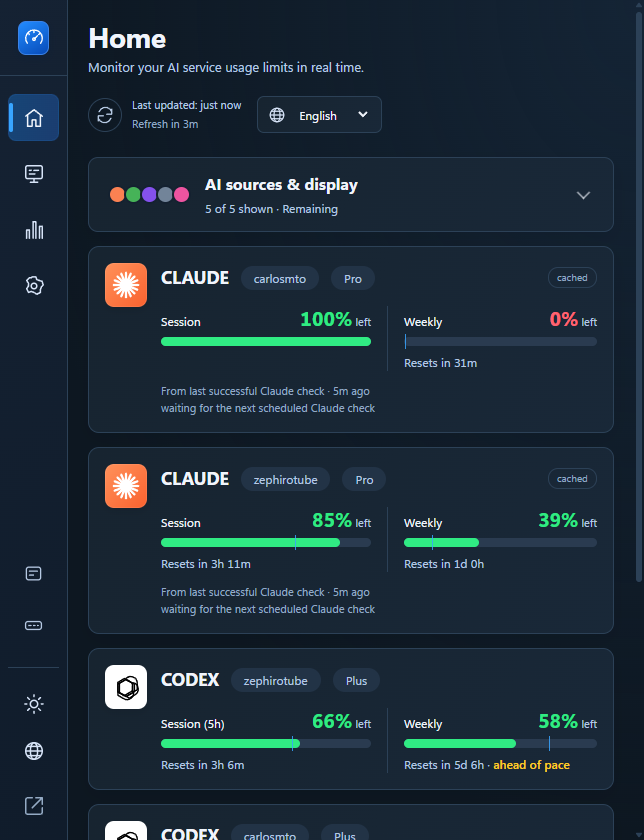
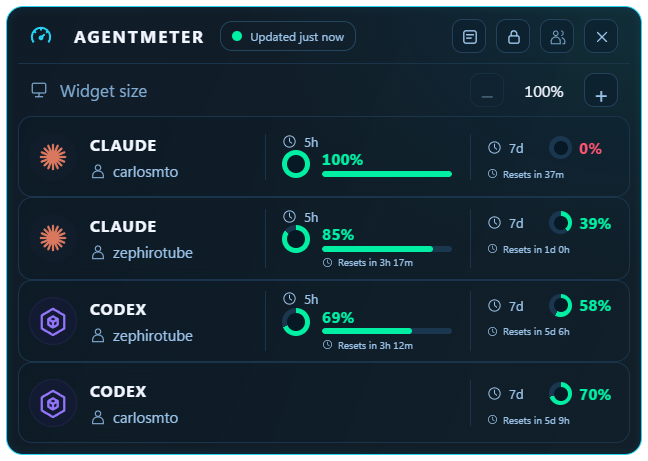
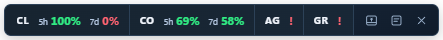

# AgentMeter

Applicazione per l'area di notifica di Windows che monitora i limiti d'uso degli abbonamenti di **Claude Code, Codex, Antigravity, Grok e Grok Bot**. Visualizza gli account in un Dashboard, in un Widget desktop o in una Strip compatta, senza gestire le credenziali in un altro servizio cloud.

**Versione attuale del codice: 0.0.1** · Windows 10/11 · Tauri + WebView2 · MIT

[English](./README.md) · [Español](./README.es.md) · [Português](./README.pt.md) · [Italiano](./README.it.md) · [Deutsch](./README.de.md) · [繁體中文](./README.zh-TW.md)

[Funzionalità](#features) · [Configurazione](#installation) · [Account](#accounts) · [Widget / Strip](#widget-strip) · [Compilazione e test](#development)

<a id="features"></a>
## Funzionalità

- **Cinque provider**, con aggiornamenti indipendenti, messaggi di configurazione/stato, letture in cache e gestione dei tentativi e delle attese. Un provider non disponibile non blocca gli altri.
- **Quattro pagine del Dashboard:** Home, Services, Statistics e Settings; barra laterale di sole icone con suggerimenti tradotti, navigazione da tastiera e nomi accessibili per i controlli.
- **Più account Claude/Codex:** profili isolati, accesso tramite CLI ufficiali, nuovi terminali specifici per account, quote/cache/attese indipendenti e un account selezionato per provider nella Strip.
- **Dettagli delle quote:** periodi dichiarati, percentuali usate/rimanenti, piano, conto alla rovescia per il ripristino, indicatori di ritmo e ripartizioni per provider/prodotto quando disponibili.
- **Widget desktop Neon:** finestra trasparente, sempre in primo piano, nomi degli account, anelli percentuali, barre di sessione, colonne 5h/7d allineate e piccoli conti alla rovescia. Gli account aggiuntivi scorrono all'interno della vista.
- **Scala del Widget:** parte da **100%**, regolabile fino a **300%** a **passi del 25%**, oltre alla scala DPI di Windows. La scala salvata non ingrandisce la Strip.
- **Strip compatta:** account selezionati e nomi abbreviati dei provider; trascinabile o fissabile sopra una barra delle applicazioni, senza riservare spazio sul desktop.
- **Controlli di visibilità:** nascondere un provider sospende le sue richieste; il gruppo Claude+GPT di Antigravity può essere nascosto/mostrato senza modificare le letture originali.
- **Preferenze persistenti:** lingua, valori usati/rimanenti, modalità della vista, scala del Widget, blocco, posizioni separate di Widget/Strip e fissaggio alla barra delle applicazioni.
- **Area di notifica e avvio:** aprire il Dashboard, mostrare/nascondere le viste, bloccare la posizione, avviare all'accesso a Windows e uscire. Il ripristino delle viste salvate viene ritentato durante l'inizializzazione di desktop/monitor.
- **Temi chiaro/scuro e cinque lingue dell'interfaccia**, applicati a Dashboard, Widget, Strip e menu dell'area di notifica. Il tema del sistema viene seguito fino a una scelta esplicita.
- **Richieste prudenti a Claude:** pausa quando Windows è inattivo/bloccato, rispetto delle attese del server anche dopo il riavvio e tentativo di recupero tramite CLI ufficiale dopo il rifiuto di un access token.
- **Integrazione locale:** utilizza sessioni desktop/CLI esistenti. Antigravity usa il proprio IDE o il server locale `agy`; non richiede estensioni del browser, account AgentMeter o telemetria.

<a id="screenshots"></a>
## Schermate

### Dashboard
<p align="center"></p>

### Widget
<p align="center"></p>

### Strip
<p align="center"></p>

Schermate reali di **AgentMeter**, non simulazioni: Dashboard con larghezza predefinita di 644 px e Widget al 100%. Letture e periodi disponibili dipendono dagli account connessi e dai relativi piani; le immagini non rappresentano quote di esempio fisse.

<a id="providers"></a>
## Provider supportati

| Provider | Dati mostrati quando disponibili | Fonte richiesta |
|---|---|---|
| **Claude** | Limiti di sessione/5 ore, settimanali e per modello; piano e ripristini | Profilo Claude Code con accesso effettuato |
| **Codex** | Sessione/5 ore e periodi settimanali o mensili, in base a piano/account | Codex Desktop o profilo Codex CLI con accesso effettuato |
| **Antigravity** | Gruppi Gemini e Claude+GPT, con periodi di 5 ore/settimanali | Antigravity IDE **oppure CLI autonoma `agy`**, autenticata e in esecuzione |
| **Grok** | Quota dell'abbonamento e ripartizioni per prodotto quando fornite | Profilo Grok Build CLI con accesso effettuato |
| **Grok Bot** | Quota settimanale separata | Applicazione desktop Grok Bot con accesso effettuato |

AgentMeter mostra i dati disponibili senza inventare periodi mancanti. Una scheda Codex solo settimanale usa l'intera area della quota. Il Widget nasconde account/provider senza letture utilizzabili; Home può mantenere schede di configurazione/errore. I provider nascosti esplicitamente non vengono interrogati.

<a id="installation"></a>
## Installazione e configurazione dei provider

1. Scarica un programma di installazione disponibile da [GitHub Releases](https://github.com/carlos-mto/AgentMeter/releases) oppure [compila il codice attuale](#development). Se non è ancora disponibile un installer, compila dai sorgenti.
2. Esegui l'installer e apri **AgentMeter**. Il codice attuale genera `AgentMeter_0.0.1_x64-setup.exe` e `agentmeter.exe`.
3. Completa l'accesso/configurazione dei provider utilizzati. Chiudere il Dashboard mantiene l'app nell'area di notifica; **Quit** termina il processo.

**Sono necessari Windows 10/11 e Microsoft Edge WebView2 Runtime.** Per compilare servono anche gli strumenti elencati sotto. I build attuali non hanno firma digitale del codice; usa release/sorgenti affidabili.

- **Claude:** installa Claude Code se necessario, esegui `claude` ed effettua l'accesso. La CLI non deve restare aperta per i controlli normali.
- **Codex:** accedi a Codex Desktop per l'account corrente oppure usa **Services → Accounts → Sign in** per un profilo CLI separato. La CLI ufficiale `codex` è richiesta per questo pulsante e **Open CLI**.
- **Antigravity:** mantieni in esecuzione l'IDE o una sessione autenticata del terminale `agy`. AgentMeter individua il server su `127.0.0.1`; non occorre configurare porte/token manualmente. Con `agy`, l'IDE non è necessario. Se entrambi sono attivi, viene preferito l'IDE. Se nessuno è attivo, i periodi in cache non scaduti possono restare disponibili fino a 24 ore.
- **Grok Bot:** installa l'[app desktop](https://docs.x.ai/grok-bot/get-started) ed effettua l'accesso. La quota è indipendente da Grok/SuperGrok. Riapri l'app quando AgentMeter richiede nuovi dati di sessione.
- **Grok:** installa Grok Build ed effettua l'accesso una volta. Riaprilo se AgentMeter richiede nuovi dati di sessione.

I modelli Gemini restano disponibili tramite i **gruppi di quota di Antigravity**, non come provider autonomo.

<a id="dashboard"></a>
## Navigazione nel Dashboard

La finestra predefinita misura **644 × 840 pixel logici**. È ridimensionabile fino a **380 × 520**, con schede adattabili e una **barra di icone di 68 px**. Passa il puntatore su un'icona per leggere il nome tradotto; le scorciatoie di tema e lingua sono vicine alla parte inferiore.

| Pagina | Scopo |
|---|---|
| **Home** | Schede per provider/account, periodi reali, piano/stato, ripristini, ritmo e ripartizioni. Aggiornamento manuale e controlli di visibilità. |
| **Services** | Unico punto per gestire account, selezionare l'account della Strip, regolare la visibilità, verificare connessioni e consultare istruzioni di configurazione. |
| **Statistics** | Tabella dello stato corrente delle quote, con valori usati/rimanenti e indicazione della cache, rispettando la visibilità di provider/gruppi. Nessuna richiesta aggiuntiva, grafico storico o media tra gruppi non correlati. |
| **Settings** | Aspetto globale, scorciatoie di lingua e valori usati/rimanenti; i controlli degli account sono in Services e non vengono duplicati qui. |

Il **pulsante a forma di occhio Claude+GPT di Antigravity** nasconde/ripristina quel gruppo in tutte le viste. Quando è nascosto, Widget/Strip usano i periodi Gemini **5h / 7d**. La preferenza non modifica le richieste né i dati originali del provider.

<a id="accounts"></a>
## Più account Claude e Codex

1. Apri **Services → Accounts**. Gli account sono raggruppati per provider.
2. Scegli Claude o Codex e premi **Add account**; dopo l'accesso l'account mostra il nome utente delle sue credenziali (fino ad allora è numerato, ad es. "Account 2").
3. Lascia vuota la directory per creare un profilo isolato oppure indica una **directory di configurazione assoluta** esistente, non un file di credenziali.
4. Usa **Sign in** per autenticarti tramite CLI ufficiale. AgentMeter non copia credenziali tra profili.

| Azione / comportamento | Risultato |
|---|---|
| **Open CLI** | Apre un nuovo terminale con solo `CLAUDE_CONFIG_DIR` o `CODEX_HOME` del profilo; terminali esistenti e ambiente globale restano invariati. |
| **Check accounts** | Controlla i profili abilitati rispettando attese e pianificazione. Claude mantiene l'intervallo minimo di sei minuti e la pausa per inattività/blocco. |
| **Selected for Strip** | Seleziona un account per provider nella Strip, senza nascondere gli altri da Home/Statistics/Widget. |
| **Remove** | Rimuove il profilo dal registro ma conserva file e sessioni in esecuzione. |
| **Current account** | Profilo predefinito implicito, che rispetta le variabili d'ambiente esistenti oppure `~/.claude` / `~/.codex`; non può essere rimosso. |

Ogni profilo ha quote/cache/attese indipendenti. I nomi utente locali disponibili hanno precedenza sugli alias; nel Widget sono più piccoli e in minuscolo. Domini e-mail e token non sono mostrati né memorizzati nel registro dei profili. Nascondere un provider sospende tutti i suoi account. Il pulsante **Accounts** del Widget apre direttamente Services.

La gestione di più account riguarda attualmente **solo Claude e Codex**. Gli altri provider mantengono il comportamento a singolo account; non è prevista rotazione automatica.

<a id="widget-strip"></a>
## Widget e Strip

Usa i pulsanti della barra laterale o il menu dell'area di notifica per scegliere una vista ausiliaria.

### Widget

- Senza bordi, trasparente, sempre in primo piano, con il simbolo del misuratore AgentMeter e il layout Neon.
- Mostra tutti gli account Claude/Codex con dati utilizzabili, anelli percentuali, barre di sessione e colonne **5h / 7d** allineate. Un account solo settimanale lascia vuota la colonna 5h; piccoli conti alla rovescia sono sotto le letture.
- Account/provider non configurati o senza dati utilizzabili sono nascosti e riappaiono quando arrivano letture valide. Le righe aggiuntive scorrono all'interno della vista.
- Trascina l'intestazione per spostarlo; usa il blocco per impedirne il movimento.
- **− / +** regola **100–300%** a **passi del 25%**. Il valore viene salvato; si applica anche la scala DPI di Windows.
- **Accounts** apre Services; **Open dashboard** apre i dettagli senza nascondere il Widget.

### Strip

- Barra orizzontale compatta con un account Claude/Codex selezionato per provider, etichette abbreviate, percentuali e suggerimenti sui ripristini.
- Come il Widget, nasconde i provider il cui account selezionato non ha ancora una lettura utilizzabile (non configurato, non disponibile, con errori o che richiedono l'accesso); controlla questi stati nel Dashboard.
- Mantiene la scala compatta originale, indipendente dall'ingrandimento del Widget.
- Trascina fuori dai controlli per spostarla. Usa il controllo a forma di puntina per mantenerla sopra una barra delle applicazioni, poi trascinala in una zona libera.
- Il fissaggio non riserva spazio sul desktop. La sovrapposizione si ritira quando la barra delle applicazioni si nasconde automaticamente o un'altra app è a schermo intero.

Widget e Strip ricordano **posizioni separate**. **Open dashboard** mantiene visibilità e fissaggio della vista; **Hide** o deselezionare l'opzione nel menu la nasconde. Entrambi riutilizzano i dati del Dashboard senza ulteriori richieste di quota.

<a id="tray"></a>
## Area di notifica e avvio automatico

Un clic sinistro sull'icona alterna la visibilità del Dashboard. Con il clic destro sono disponibili **Open dashboard**, **Show widget**, **Show strip**, **Lock widget position**, **Launch at startup** e **Quit**.

Abilita **Launch at startup** se desiderato. Prima di uscire, seleziona Widget o Strip se vuoi ripristinare quella vista all'accesso a Windows. L'avvio usa `--hidden`: il Dashboard resta chiuso e modalità, scala e posizione salvate vengono ripristinate con nuovi tentativi durante l'inizializzazione di desktop/monitor. Senza una vista ausiliaria abilitata, l'avvio nella sola area di notifica è intenzionale.

<a id="appearance"></a>
## Aspetto e lingua

- **Tema:** chiaro e scuro in tutta l'app; segue il sistema fino a una scelta esplicita. Il Widget mantiene il trattamento Neon e la finestra trasparente; testo e controlli non sono attenuati.
- **Visualizzazione della quota:** scegli **Used** o **Remaining**, in modo uniforme per Dashboard, Statistics, Widget e Strip.
- **Lingue dell'interfaccia:** **English, Español, Português, Italiano e Deutsch**. Cambia **Language** in alto a destra o tramite la scorciatoia nella barra laterale/Settings. La scelta persiste e si applica anche al menu dell'area di notifica.
- Al primo uso viene rilevata una lingua di Windows supportata; altrimenti si usa l'inglese. Nomi dei provider e diagnostica tecnica grezza mantengono il testo originale.

La documentazione è disponibile in inglese, spagnolo, portoghese, italiano, tedesco e cinese tradizionale. Un README cinese **non** significa che sia già implementata un'interfaccia cinese.

<a id="privacy"></a>
## Privacy, dati locali e compatibilità

Nessuna telemetria, analisi d'uso o account cloud AgentMeter. I controlli delle quote contattano i provider usando sessioni locali supportate; non esiste un servizio AgentMeter di caricamento/sincronizzazione.

- AgentMeter legge le credenziali di accesso desktop/CLI esistenti quando necessario, ma non usa i refresh token dei provider. Dopo un `401` di Claude, tenta il recupero con `claude update` e rilegge l'access token; il comando può aggiornare Claude Code stesso.
- Antigravity viene interrogato tramite il server locale dell'IDE/`agy`, senza gestire un accesso Google.
- L'access token di breve durata di Grok Bot viene sbloccato localmente con Windows DPAPI per la richiesta; il suo refresh token non viene decifrato, usato, memorizzato in cache o inviato da AgentMeter.
- Aggiungere un profilo non copia credenziali; rimuoverlo non elimina i file dell'account.

La cartella dati è **`%LOCALAPPDATA%\stackly-agent-manager`**. Le directory CLI esterne restano invariate:

| Posizione / identità | Scopo |
|---|---|
| `accounts.json` | Alias, percorsi di configurazione e account selezionati per la Strip, non credenziali. |
| `accounts/<provider>/<id>` | Directory predefinite per profili isolati; le CLI ufficiali gestiscono le sessioni. |
| `widget.json` | Preferenze di visualizzazione/lingua e posizioni salvate. |
| `provider-cache` | Stato di quote/attese e diagnostica limitata. |

<a id="troubleshooting"></a>
## Risoluzione dei problemi

| Sintomo | Verifica |
|---|---|
| Provider/account assente dal Widget | Abilita il provider in Services e completa l'accesso. Il Widget richiede letture utilizzabili; Home può mostrare configurazione/errore. |
| Widget/Strip non torna all'accesso | Abilita **Launch at startup** e salva la modalità desiderata, non solo Dashboard. Attendi il ripristino di desktop/monitor; apri la vista dal menu se necessario. |
| Grok assente o richiede accesso | Installa/apri Grok Build, accedi e aggiorna la scheda. AgentMeter non rinnova il token CLI autonomamente. |
| Claude limitato dal server | Rispetta il conto alla rovescia. Aggiornamento manuale e **Check accounts** non aggirano le attese; riavviare non le cancella. |
| Claude non si aggiorna con Windows inattivo/bloccato | Pausa intenzionale; alla ripresa dell'attività i controlli sono ritardati per evitare una raffica di richieste. Le attese esistenti restano valide. |
| Claude rifiuta l'access token | Si tenta il recupero tramite CLI ufficiale; se fallisce, apri Claude Code e verifica l'accesso. |
| Antigravity richiede un client | Mantieni in esecuzione l'IDE o una sessione `agy` autenticata. Installare `agy` o eseguire solo `agy --help` non basta. |
| Grok Bot richiede accesso | Riapri Grok Bot; un controllo successivo leggerà il nuovo access token di breve durata. |
| Autore sconosciuto in Windows | I build non hanno firma digitale; usa release affidabili o compila dai sorgenti. |

<a id="limitations"></a>
## Limiti

- **Solo Windows**; il progetto non supporta attualmente build macOS/Linux.
- Gli endpoint dei provider non sono documentati; disponibilità, piani e formati possono cambiare indipendentemente.
- Statistics rappresenta lo stato corrente, non uno storico salvato, un rapporto di fatturazione dei token o una previsione.
- Profili con più account sono supportati solo per Claude/Codex; la rotazione automatica non è implementata.
- Esiste una sola finestra ausiliaria: può spostarsi tra monitor, ma Widget/Strip **non viene duplicato automaticamente su ogni monitor/barra delle applicazioni**.
- I dati in cache sono segnalati esplicitamente e non garantiscono quote in tempo reale.

<a id="development"></a>
## Compilare e testare dai sorgenti

### Requisiti

- Windows 10/11 e WebView2 Runtime.
- **Node.js 22+** con npm, necessario anche per i probe nativi opzionali.
- **Rust stable**, con toolchain Windows MSVC.
- Visual Studio / Build Tools con **Desktop development with C++** e Windows 10/11 SDK.

Dalla radice del repository:

```powershell
npm ci
npm run tauri -- dev
```

Compila l'installer Windows:

```powershell
npm run tauri -- build --bundles nsis -- --locked
```

File generati per 0.0.1:

```text
src-tauri/target/release/agentmeter.exe
src-tauri/target/release/bundle/nsis/AgentMeter_0.0.1_x64-setup.exe
```

Rilascio: `npm run release` (o `pwsh scripts/release.ps1 -DryRun` per provarlo) esegue i test, compila l'installer NSIS, crea il tag `v<versione>` e pubblica la GitHub Release con l'installer e il suo SHA-256. Richiede `gh auth login`.

Esegui i test automatici:

```powershell
npm test
cargo test --locked --manifest-path src-tauri/Cargo.toml
```

I probe nativi opzionali di [Dashboard](./tests/smoke/dashboard.smoke.mjs) e [account](./tests/smoke/accounts.smoke.mjs) richiedono **CDP temporaneo limitato al loopback**; non serve nell'uso normale e non deve restare abilitato. Consulta l'[architettura](./docs/architecture.md) per dettagli di implementazione, politiche di richiesta e integrazione nativa.

<a id="project"></a>
## Progetto e licenza

- [Architettura](./docs/architecture.md)
- [Architettura Tauri + Rust + Windows](./docs/tauri-rust-windows-architecture.md)
- [Segnalare un problema](https://github.com/carlos-mto/AgentMeter/issues)
- Ispirato a diversi progetti e strumenti della comunità.

Distribuito con [licenza MIT](./LICENSE).
